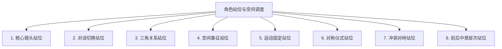

# AI短剧与漫剧导演级拍摄分镜完全指南

> [!NOTE]
> 本手册融合了 13 篇微信公众号文章中 AI 漫剧与短剧创作者的实战干货，涵盖最新的《专业镜头构图灵感手册》内容。这是一份系统性的分镜与运镜规范，可供导演、摄影、AI 视频创作者直接作为日常拍摄与提示词编写参考。

> 📎 **关联文档**：总入口 [README](README.md)。本文件是**分镜/运镜/景别/光影/站位**权威源；连续性与轴线衔接见 [连续性设计指南](AI短剧连续性设计指南.md)，表演/表情细节见 [表演细节指南](AI短剧表演细节与提示词指南.md)，画风调色见 [画质风格类型总结.md](画质风格类型总结.md)。

---

## 一、 题材开发与导演风格定位

### 1.1 题材定位与创作限制
在AI视频/漫剧创作中，题材通常以**强情绪、高张力、快节奏**的类型片（如都市复仇、科幻悬疑、武侠对决、古风仪式等）为主。AI技术的底层逻辑决定了动作表达存在“安全区”与“高风险区”：
*   **动作安全区**：缓慢行走、转头、轻柔微风、轻轻抬手、端咖啡杯、微表情变化。动作越缓慢、自然，AI生成的稳定性越高。
*   **高风险区**：激烈的打斗、奔跑、高难度舞蹈、多人复杂身体接触或大范围肢体扭曲。这类动作在生成时极易产生人体畸变和画面崩溃。

### 1.2 导演风格与“电影感”基因
电影感的本质是用**镜头讲故事**。为避免AI生成画面呈现“会动的PPT”或“平庸的中景幻灯片”，导演必须通过提示词构建底层视觉基因：
*   **画幅比例**：推荐使用 `16:9` 或 `2.39:1` 变形宽银幕（Anamorphic）比例。
*   **胶片质感**：使用 `Kodak Portra 400`、`Kodak Vision3 500T`、`35mm lens`、`film grain`（胶片颗粒感）等词汇稳定画质风格。
*   **构图语法**：拒绝AI默认的平视中景居中，通过景别与构图（三分法、引导线、对角线）来控制信息量，引导观众视线。

---

## 二、 角色主体与一致性控制（DNA 档案）

角色一致性（人设不崩溃）是连贯叙事的核心。必须构建“五维框架”并进行多重锁定。

### 2.1 角色 “DNA” 特征清单与描述规范
必须为角色建立清晰、可量化的特征，避免抽象形容词：

| 维度 | 核心特征清单 | 描述技巧与控制词示例 |
| :--- | :--- | :--- |
| **面部** | 脸型、眼距、鼻梁高度、眉形、特定标记 | “瓜子脸，剑眉星目，左眼下方有一颗泪痣，`consistent facial structure`，`locked face identity`” |
| **发型** | 发色、长度、质地、分缝位置 | “黑色碎发，`保持发型不变`，`与参考图中发型一致`” |
| **体型** | 身高、肩宽、四肢比例 | “身高180cm，偏瘦体型，九头身比例，`normal human proportions`” |
| **服饰** | 核心主色调、款式、材质、标志性配件 | 固定描述句式：“身穿黑色连帽卫衣，配戴银色项链” |
| **情绪/动作** | 常用表情气质、眼神特征 | “眼神冷峻，嘴角习惯性微扬，符合XX性格” |

### 2.2 工具端特征锁定技术
1.  **Midjourney 平台（Niji 6 / V6）**：
    *   **公式**：`[角色在当前场景下的动作描述] --cref [基础参考图链接] --cw 100 --seed [固定数值] --ar 16:9`
    *   `--cw 100` 用于完全锁定发型、服饰；若需要换装，可将 `--cw` 下调至 `0` 仅锁定面部特征。
2.  **Stable Diffusion 平台**：
    *   **IP-Adapter + ControlNet (Face Landmark)**：高保真还原面部细节。
    *   **LoRA 训练**：针对长期连载的定制角色，准备 20-50 张多角度训练集。
    *   **InstantID**：基于 SDXL 的超精准单图面部锁定。
3.  **StoryDiffusion / ComicAI**：
    *   利用“角色记忆”和角色三视图迭代，确保跨镜头人设稳定。

---

## 三、 服饰与造型标准

在长剧集中，服饰变化会导致严重的“出戏”：
*   **强制锁定指令**：在每个分镜的提示词中，服饰词组顺序、修饰词必须保持绝对一致。如：“*wearing a classic khaki trench coat over a white shirt, single silver ring on left index finger*”。
*   **排除词机制（Negative Prompt）**：使用 `--no extra accessories, changing clothes, changing patterns` 过滤AI的随机发挥。
*   **后期校准**：如果局部服饰崩坏，使用 **SD Inpaint（局部重绘）** 并设置低重绘强度（`0.3-0.5`），或者利用 Photoshop 克隆图章微调。

---

## 四、 角色站位与空间调度（Blocking）

角色的站位方式直接表达了人物关系、心理距离与叙事张力。以下是8种行业通用站位法：



### 4.1 8种角色站位法详解
1.  **核心镜头站位法**：
    *   *定义*：主角固定在画面中心或黄金分割点上，配角在其左、右、前、后形成视觉平衡。
    *   *调度建议*：中远景建立空间，注意**180度运动轴线**与**视线轴线**一致，角色A看向右侧，角色B看向左侧，切忌翻转。
2.  **对话切换站位法**：
    *   *定义*：双人对话时使用“镜像站位”或“90度倾斜侧身站位”。
    *   *调度建议*：采用正反打（Shot-Reverse Shot）过肩拍摄，眼线高度与方向必须匹配。
3.  **三角关系站位法**：
    *   *定义*：多用于打斗、对峙或三人场景，主角在中景，两个配角在前景和背景形成三角形稳定构图。
    *   *调度建议*：中景为主，摄像机可做小幅度弧形滑移，但不可跨越关系轴。
4.  **空间象征站位法**：
    *   *定义*：通过物理高低、远近表达权力或心理状态。
    *   *调度建议*：强权者站立于高台（仰拍），被动者位于低处（俯拍），镜头轴线保持在同侧。
5.  **运动固定站位法**：
    *   *定义*：多镜头场景中，明确标记角色移动的起点、转折点和终点。
    *   *调度建议*：镜头跟随方向与角色运动方向完全一致（前跟/后跟/侧跟），避免视线轴错乱。
6.  **对称仪式站位法**：
    *   *定义*：沿中轴线将角色左右对称排列，用于体现正式、庄重、秩序。
    *   *调度建议*：正面居中构图，缓慢直线推镜（Dolly In）。
7.  **冲突对峙站位法**：
    *   *定义*：将两组阵营分立左右两侧，中间留出空白区域作为“张力空间”。
    *   *调度建议*：由全景（交代阵势）切换到中景，沿中轴线缓慢推进。
8.  **前后中景层次站位法**：
    *   *定义*：利用道具或次要角色作前景遮挡，中景放主角，背景是环境。
    *   *调度建议*：镜头横向平移，通过景深变化（Rack Focus）转移焦点。

### 4.2 电影级空间环境镜头灵感库（16种）
环境不是背景，它决定人物的处境。利用以下经典环境构图，迅速建立处境与叙事空间：

| 序号 | 镜头名称 | 画面作用/视觉心理 | 推荐适配情节 |
| :--- | :--- | :--- | :--- |
| 1 | **长廊尽头镜头** | 利用纵深线条制造压迫感、目的地感与未知恐惧。 | 追寻、等待、未知前方、走向决战 |
| 2 | **空旷广场镜头** | 将人物大范围缩小在宏大空间中，体现孤立无援与迷失。 | 迷失、孤独、清晨开场、危机四伏 |
| 3 | **窗边停顿镜头** | 窗框形成边界，把室内人物与窗外世界对比，增加思考感。 | 心事、思念、夜谈、做决定前夕 |
| 4 | **桥面远景镜头** | 桥体延伸画面空间，强化离开、启程或前往的宿命感。 | 启程、分别、默默等待、告别过去 |
| 5 | **街口等待镜头** | 道路交汇点与闪烁霓虹，增加都市故事感与复杂性。 | 赴约、错过、偶遇前夕、夜间侦查 |
| 6 | **过道跟拍镜头** | 在狭长连续空间中跟随人物移动，增强节奏感与临场感。 | 跟随、紧急赶路、紧张追捕 |
| 7 | **楼顶俯视镜头** | 俯瞰繁华城市背景，强调人物渺小、虚无与处境压力。 | 抉择、低潮、夜景段落、情绪宣泄 |
| 8 | **电梯开门镜头** | 利用电梯门关合的动作，制造出进出、揭示与空间切换感。 | 强者登场、戏剧转场、悬念推进 |
| 9 | **室内角落镜头** | 人物放置于边角局促空间中，直接制造压缩感与被困感。 | 低谷期、暗藏秘密、孤独独处 |
| 10 | **门口压迫镜头** | 用门框作为框架封锁包围人物，形成无形边界与僵持限制。 | 严厉质问、阻拦离去、对峙僵持 |
| 11 | **巷道纵深镜头** | 狭窄通道与重复线条，强烈暗示悬疑、跟踪或未知危险。 | 调查真相、被跟踪、小巷逃离 |
| 12 | **雾中小路镜头** | 能见度严重降低，隐蔽细节，制造出浓烈的神秘与宿命感。 | 朦胧回忆、梦境闪回、未知旅程 |
| 13 | **雨巷倒影镜头** | 利用地面大量积水和倒影丰富视觉层次，升华夜景氛围。 | 失意、都市雨夜行走、回望感悟 |
| 14 | **森林穿行镜头** | 用树木等自然元素遮挡主体，结合透射光缝隙营造探索感。 | 冒险探秘、寻找线索、密林逃亡 |
| 15 | **地下通道镜头** | 狭长、封闭、昏暗的地下走廊，快速建立压抑与幽闭紧张。 | 黑暗追逐、隐匿行动、危险正在逼近 |
| 16 | **海边留白镜头** | 利用大面积的海面/天空空白与远景人物，保留情绪余味。 | 告别过去、彻底释怀、故事结尾收束 |

---

## 五、 动作与表情控制

AI视频制作的核心原则是“**动作写慢、动作写简**”，通过微表情与间接动作传达丰富情绪，避免硬直打斗。

### 5.1 动作安全区 VS 高风险区
*   **安全动作词**：`slowly turning head` (缓慢回头), `gentle smile` (温柔微笑), `hair blowing in the wind` (微风拂发), `taking a sip of coffee` (轻抿咖啡), `standing still looking down` (静立俯视).
*   **高风险/禁用词**：`running fast` (快速奔跑), `punching and kicking` (拳脚交加), `dancing dynamic hip-hop` (跳街舞), `climbing steep cliff` (攀爬陡峭悬崖).

### 5.2 情绪表达具象化（杜绝抽象词）
> [!WARNING]
> 不要使用“感到非常紧张”、“愤怒”等抽象词，AI无法理解主观情绪，会导致角色面部扭曲或表情平淡。

*   **错误写法**：*An angry office lady.*
*   **正确写法**：*A close-up shot of an office lady, eyebrows furrowed, lips pressed into a tight thin line, hands tightly clutching the edge of the desk, knuckles turning white.* (眉头紧锁、嘴唇紧闭成线、双手紧握桌角、指关节发白)

---

## 六、 光影渲染与氛围营造

光影是电影感的灵魂，控制光影能让平淡的画面瞬间充满叙事张力。氛围感的关键，不是亮，而是光线关系。

### 6.1 黄金光影词库
*   **Rembrandt Lighting（伦勃朗光）**：经典的戏剧性面部阴影，在一侧脸颊形成三角形亮区，适合深沉、阴郁、思考的文戏。
*   **Tyndall Effect / Volumetric Light（丁达尔效应/体积光）**：光斑与光束可见，多用于密林、地窖、神秘废墟，营造神圣或压抑感。
*   **Teal and Orange Color Grading（青橙电影色调）**：冷色调阴影与暖色调高光对立，极具工业级商业大片质感。
*   **Chiaroscuro / Dramatic Shadows（明暗对比）**：极端的亮部与暗部对峙，用于营造悬疑、恐怖或黑色电影风格。
*   **Golden hour backlight（黄金时刻逆光）**：夕阳斜射，主体轮廓发光（Rim light），适合温馨、怀旧、回忆的镜头。

### 6.2 电影级光影氛围镜头灵感库（16种）
先找光，再构图，光线决定了情绪的温度：

| 序号 | 镜头名称 | 画面作用与艺术表现 | 推荐适配情节 |
| :--- | :--- | :--- | :--- |
| 1 | **逆光尘埃镜头** | 让可见的光束（丁达尔光）与空气微粒交融，富有神圣与史诗感。 | 故事开场、回忆重现、命运抉择 |
| 2 | **百叶窗光影镜头** | 百叶窗将光线切割成黑白条纹，制造强烈的秩序感与心理压迫。 | 密室审问、反省独处、悬疑阴谋 |
| 3 | **路灯独照镜头** | 在黑暗中用单一光源包裹主体，极大突出夜色的孤独与冷清。 | 默默守候、深夜失眠、孤独夜归 |
| 4 | **霓虹侧脸镜头** | 将彩色的城市霓虹光打在角色面部轮廓，表现强烈的都市寂寞。 | 繁华街头、迷茫流浪、午夜沉沦 |
| 5 | **局部打光镜头** | 聚光灯只照亮局部（如手、钥匙），使画面高度聚焦、充满神秘。 | 发现关键线索、秘密揭示、重要物品亮相 |
| 6 | **烛火暖光镜头** | 用极柔和的暖色小光源，营造极具亲密、怀旧与安静的心理场。 | 深夜谈心、感念旧事、温柔情感片段 |
| 7 | **冷暖对撞镜头** | 画面中同时出现冷蓝色温与暖橙色温，强化人物的冲突与博弈。 | 激烈争执、心理博弈、关键转场时刻 |
| 8 | **水面反射镜头** | 借地面积水反射天空或霓虹，补充倒置视觉，使静态画面更灵动。 | 雨后初晴、梦境世界、抒情写意段落 |
| 9 | **雾气包裹镜头** | 降低背景清晰度与边界感，使得周遭空间充满梦幻、未知与迷茫。 | 梦境空间、模糊记忆、神秘人物出场 |
| 10 | **金属反光镜头** | 借金属/玻璃的冷峻硬质折射，展现工业冰冷感与现代科幻感。 | 科幻场景、重工业废墟、危险杀机逼近 |
| 11 | **雨滴挂窗镜头** | 隔着挂满雨滴的玻璃看人物，制造天然的距离感与情绪阻隔。 | 车内怅惘、无奈离别、深情回望 |
| 12 | **烟雾剪影镜头** | 让人物隐藏在缓缓上升的烟雾中，只露边缘光，含蓄表达情绪。 | 烟雾亮相、隐藏悬念、压场与决裂时刻 |
| 13 | **暗部留黑镜头** | 主动大面积保留深色阴影，把空间交给黑暗，带来强烈的神秘感。 | 惊悚突袭、暗中潜伏、心理暗涌戏 |
| 14 | **边缘轮廓光镜头** | 主体身后强光源照亮发丝与身段，利用一圈光芒让人物跃出黑暗。 | 英雄觉醒、高光出场、强情感宣泄点 |
| 15 | **长阴影地面镜头** | 将斜阳拉长的巨大倒影作为画面的主要构成，延展无声情绪。 | 黄昏落幕、孤独前行、预示巨变降临 |
| 16 | **夜色群像镜头** | 多个人物局部隐没在极有限的暗光中，暗示复杂深层的权力关系。 | 秘密聚会、危险组织会议、群像心理战 |

---

## 七、 景别控制（Framing）

“远景看环境，全景看姿态，中景看关系，近景看表情，特写看细节。”

### 7.1 五大核心景别分类
```markdown
1. 远景 (Extreme Wide Shot - EWS)
   └─ 交代环境，建立世界观。人物仅占画面极小部分，适合开场或转场。
2. 全景 (Wide Shot - WS)
   └─ 展现人物全身及与周围环境的位置关系，常用于动作或登场。
3. 中景 (Medium Shot - MS)
   └─ 腰部以上。人物与背景平衡，最舒适的日常叙事、对话景别。
4. 近景 (Medium Close-up - MCU)
   └─ 胸部/肩部以上。聚焦面部细微表情与心理变化，用于冲突引入。
5. 特写/大特写 (Close-up / ECU)
   └─ 仅展现眼部、手指或微小道具。制造极强压迫感，或强调关键悬念。
```

### 7.2 经典分镜景别组合实战
*   **电影式经典开场**：
    `大远景（空镜，交代世界观）` $\rightarrow$ `全景（主角走向前，建立位置）` $\rightarrow$ `中景（主角开始执行动作）` $\rightarrow$ `近景（特写面部，流露悬疑情绪）`
*   **冲突爆发节奏**：
    `中景对话（关系平稳）` $\rightarrow$ `近景正反打（言语挑衅，情绪升级）` $\rightarrow$ `局部特写（手握紧拳头/冷汗，张力到顶点）` $\rightarrow$ `远景拉远（其中一人离去，留白收尾）`

---

## 八、 分镜与运镜手法（36种运镜系统）

根据镜头运动特性和叙事目的，将36种运镜方法分类如下：

### 8.1 基础叙事运镜（6种）
1.  **慢推近景 (Slow Dolly In)**：摄像机稳步拉近，强调情绪变化，锁定注意力。
2.  **慢拉远 (Slow Dolly Out)**：镜头向后退去，展示角色孤独或环境空旷，揭示真相。
3.  **低升俯视 (Crane Up & Tilt Down)**：相机从地面平稳上升并向下俯视俯瞰。
4.  **贴身跟移 (Steadicam Side Follow)**：侧面与人物平行移动，保持同速，记录行走。
5.  **环绕凝视 (360-degree Orbit)**：摄像机以主体为圆心环绕，增强三维空间感。
6.  **斜角旋转 (Dutch Angle & Spin)**：画面发生歪斜倾斜并旋转，表达混乱、眩晕或危机。

### 8.2 动态动作运镜（6种）
7.  **背后追拍 (Rear Chase Shot)**：摄像机紧跟角色背后疾行，制造紧迫的逃亡感。
8.  **正面退拍 (Frontal Tracking Retreat)**：角色前行，摄像机在正面以同速后退跟拍。
9.  **侧面平行跟拍 (Lateral Tracking Shot)**：平移跟拍冲刺中的主体，背景拉出动态模糊。
10. **过肩跟拍 (Over-the-shoulder Chase)**：模糊的肩膀作为前景，跟随前方的追逐目标。
11. **第一人称穿行 (POV Traverse)**：模拟主观视角的视角晃动，穿梭在人群或狭窄空间中。
12. **手持晃动 (Handheld Shake)**：存在细微的、不规则的物理颠簸，呈现纪实粗粝感。

### 8.3 爆点与视觉张力运镜（6种）
13. **快速突进 (Zoom / Snap Push)**：不到一秒内视距瞬间拉近，强调震惊、顿悟。
14. **冲击拉远 (Zolly / Fast Pull Back)**：瞬间拉远，急速揭开巨大的背景或包围圈。
15. **俯冲下降 (Drone Dive)**：无人机高空极速垂直俯冲，多用于宏大战斗或开场。
16. **低机位仰拍推进 (Low-angle Push)**：贴近地面的低角度向前推进，增加角色的伟岸度与压迫感。
17. **高机位压迫跟拍 (High-angle Follow)**：俯视角度在斜上方跟随，体现被追踪者的弱小无助。
18. **极近特写推进 (Extreme Close-up Dolly)**：镜头直接逼近眼部或关键物品，形成极度屏息的视觉压迫。

### 8.4 电影级无缝转场运镜（6种）
19. **慢摇揭示 (Pan Reveal)**：相机原地水平旋转，划过无关联空间，自然引出新场景。
20. **甩镜转场 (Whip Pan / Swish Pan)**：镜头以极高速度掠过，形成横向模糊，切入下一镜头。
21. **前景遮挡转场 (Foreground Occlusion)**：人物走向一堵墙或柱子完全遮挡屏幕，切入时从另一堵墙后移出。
22. **空镜推轨转场 (Empty Track Transition)**：镜头横移划过安静的背景，借由相似色调或光影切换场景。
23. **匹配转场 (Match Cut)**：利用两个场景中形状、动作相似的主体进行无缝衔接。
24. **变焦散景转场 (Out-of-focus Bokeh)**：镜头失焦变模糊，画面全是美丽光斑，再聚焦时已切换空间。

### 8.5 细节与线索运镜（6种）
25. **焦点转移 (Rack Focus / Focus Shift)**：前景清晰/背景模糊，平滑转移到前景模糊/背景清晰，引导视线。
26. **微距扫过 (Macro Sweeping)**：在极近距离划过物体表面，突出材质细节或微小刻字。
27. **景深漂移 (Depth of Field Drift)**：利用极浅景深，使焦点在不同深度的线索道具间闪烁转移。
28. **细节追踪 (Detail Tracking)**：跟随运动中的道具（如滚动的骰子、滑落的眼泪）。
29. **光影扫描 (Light Sweep)**：镜头不动，一束强光划过黑暗中的道具，突出局部。
30. **反向焦点折返 (Reverse Rack Focus)**：焦点从背景人物拉回到近处前景人脸的细微表情上。

### 8.6 氛围与情绪深描运镜（6种）
31. **远景建立 (Establishing Shot)**：宽阔、平静的远视角，用于营造末日、冷酷的外部宏大感。
32. **静止凝视 (Static Stare)**：摄像机绝对不动，仅凭环境微弱的摆动（如树叶、烛光）反衬死寂。
33. **漂浮移动 (Floating / Gliding)**：模拟无重力状态下的微幅漂浮，营造幽灵感、科幻或梦境感。
34. **时间凝固推进 (Bullet Time Dolly)**：主体动作极慢或静止，摄像机在中等速度下环绕推进。
35. **环境压迫推进 (Enclosing Push)**：穿过错综复杂的环境元素（如铁丝网、石柱）推向主角，体现被困感。
36. **希区柯克变焦 (Hitchcock Zoom / Dolly Zoom)**：机身向后移的同时光学向前变焦，主体大小不变，背景扭曲，表达晕眩与极度惶恐。

---

## 九、 人物叙事、镜头视角与构图进阶（追加）

在AI短剧的分镜设计中，视角的运用与画面选择构成了叙事的主体框架。

### 9.1 经典三大镜头视角 (POV)
*   **主观视角 (POV - Point of View)**：精确呈现角色的视线。在提示词中加入 `first-person point of view`、`looking through the eyes of the character`，能极大地将观众带入现场，感受极度紧迫感。
*   **过肩视角 (OTS - Over The Shoulder)**：将另一名角色的后脑勺或肩膀作为虚化的前景。它能在对话场景中提供稳定的空间方位感，使画面层次更加立体。
*   **荷兰斜角 (Dutch Angle / Canting)**：倾斜相机的地平线。在表达悬疑、心理崩溃、失控或突发袭击时，使用 `canted angle`、`slanted frame`，可以营造画面失衡的视觉刺痛感。

### 9.2 电影级人物叙事镜头灵感库（16种）
先定情绪，再选镜头。人物镜头从来不是随便架机位，而是推演情绪与传递关系的媒介：

| 序号 | 镜头名称 | 画面作用/视觉心理 | 推荐适配情节 |
| :--- | :--- | :--- | :--- |
| 1 | **正面特写镜头** | 直视面部，放大表情细微抽搐与眼神细节，建立极强的情感共鸣。 | 独白泄密、心事重重、极度崩溃爆发 |
| 2 | **侧面轮廓镜头** | 仅保留剪影轮廓和单侧亮光，情感表达偏冷峻、克制和客观。 | 闭门沉思、压抑气氛、静谧夜谈 |
| 3 | **半身近景镜头** | 腰部以上近景，兼顾背景空间、肢体动作与面部神态。 | 角色对话、刺探情报、情感关系拉扯 |
| 4 | **背影引导镜头** | 隐去表情，利用背部的线条和方向制造强烈的距离感与留白空间。 | 孤独离开、静默等待、长街孤独行走 |
| 5 | **低机位仰拍镜头** | 从低机位仰望角色，使其在视觉上高大，凸显权威、压迫或力量感。 | 绝境反击、强势登场、掌控全局时刻 |
| 6 | **高机位俯拍镜头** | 从高处俯视观察角色，使其在视觉上缩水，呈现脆弱、无助与失控。 | 惨遭挫败、迷失方向、被困绝望境地 |
| 7 | **手部细节特写** | 聚焦紧捏的指尖、揉捏的物件等手部微表情，传递隐藏的内心剧本。 | 极度紧张、犹豫不决、生死诀别前夕 |
| 8 | **回眸定格镜头** | 角色前行中突然回头，凝视相机，制造强烈的情绪驻留与回味点。 | 依依告别、瞬间心动、突如其来的剧情转折 |
| 9 | **双人对话对切** | 在两人的单人近景镜头间快速交替，强化语言交锋与地位博弈。 | 严厉审问、深情告白、针锋相对的争执 |
| 10 | **镜中映像镜头** | 借镜子、水面、刀光上的映像交代双重线索，折射内心真实挣扎。 | 掩藏秘密、面对自我、痛苦的回忆拷问 |
| 11 | **门缝窥视镜头** | 镜头透过窄窄的门缝/窗缝拍摄，利用粗重的前景制造强烈的窥探悬念。 | 暗中跟踪、线索调查、执行隐蔽计划 |
| 12 | **车窗凝视镜头** | 人物半张脸贴在玻璃上，与流动的车外背景叠合，烘托失落与游离。 | 伤感离别、旅途思索、情绪迟疑不决 |
| 13 | **雨夜独行镜头** | 主角雨中孤立前行，配合霓虹反射与冰冷水汽，加倍渲染凄凉感。 | 遭遇失落、仓皇逃离、心碎欲绝时刻 |
| 14 | **楼梯转身镜头** | 利用楼梯高低的纵向阶梯层级与瞬间的转身，形成位置错动和惊艳感。 | 偶遇仇敌、慌乱追逐、剧情转折重逢 |
| 15 | **逆光剪影镜头** | 黑影在巨大强光背景中被彻底剥离细节，情绪表达具有诗意与命运感。 | 诀别告别、面临重大抉择、宿命对决 |
| 16 | **群像关系镜头** | 宽幅全景下安排主次、高低、聚散站位，一眼传达阵营和话语权。 | 决战对峙、圆桌会议、复杂的团队冲突 |

---

## 十、 情绪表达与AI提示词完全公式

### 10.1 AI视频/漫剧万能提示词结构公式
为了让AI高成功率出片，提示词必须覆盖以下八大核心模块：

$$\text{提示词} = \text{[主体]} + \text{[主体动作]} + \text{[场景/环境]} + \text{[光影/色调]} + \text{[运镜动作及约束]} + \text{[视觉风格]} + \text{[画质修饰]} + \text{[稳定性约束]}$$

### 10.2 黄金15秒时间轴切片模型
静态画面容易让人感到疲劳。将15秒的AI视频，划分为**四段式镜头节奏**组合，能产生真正大片级的视听体验：

```
⏰ 0s ──────────────── 3s ─────────────── 7s ────────────── 11s ────────────── 15s
   │  [第一切片：全景段]  │  [第二切片：中景段]  │ [第三切片：特写段]  │ [第四切片：收尾段]  │
   ▼                     ▼                     ▼                    ▼                    ▼
 交代场景与整体氛围    主角登场，启动动作    动作细节，情绪传递   动作收尾，悬念拉远/转场
```

*   **0~3秒（全景/大远景）**：交代故事背景与空间。如：雨夜冷清的街道，远处霓虹闪烁，`establishing wide shot`。
*   **3~7秒（中景跟随）**：主角正式登场。如：一个身穿黑色风衣的男子撑伞缓慢前行，`medium shot, tracking follow`。
*   **7~11秒（局部特写/近景）**：冲突起燃或情绪聚焦。如：特写镜头聚焦男子紧绷的侧脸，眼神中露出震惊，`close-up shot, shallow depth of field`。
*   **11~15秒（拉远收束/平滑转场）**：画面以悬念收尾。如：镜头快速向后拉远，露出男子身边隐藏在暗处的黑影，`dolly out, high dynamic change`。

### 10.3 经典镜头组合思路与黄金原则
单个镜头决定表达，多镜头组合决定节奏。学会组合镜头，画面就不只是好看，而是会讲故事：

#### 10.3.1 八大经典镜头组合模板
1.  **开场建立组** (`全景` $\rightarrow$ `中景` $\rightarrow$ `特写`)：由大入小。先交代完整故事空间，再逐步锁定特定人物与关键事件的核心点。适用于：角色出场、新剧本开篇。
2.  **情绪升级组** (`平视/中景` $\rightarrow$ `近景` $\rightarrow$ `极近特写`)：层层递进。视距不断压迫，将角色的面部崩溃、挣扎或狂喜一步步推向观众眼前。适用于：角色内心独白、崩溃、深情告白。
3.  **关系拉扯组** (`对切镜头` $\rightarrow$ `手部特写` $\rightarrow$ `对方反应镜`)：注重潜台词。通过正反打对切加手部细节（如搓揉衣角、玩弄戒指），揭示两人语言之下的暗涌博弈。适用于：商务谈判、谈判争执、暧昧试探。
4.  **悬疑窥视组** (`环境空镜` $\rightarrow$ `遮挡窥视` $\rightarrow$ `背影离场`)：构建悬念。先用无人空镜展现寂静，再切换到门缝等遮挡角度偷窥，最后跟随背影，不断加深未知压迫感。适用于：暗中调查、跟踪尾随、执行秘密行动。
5.  **孤独氛围组** (`大远景环境` $\rightarrow$ `孤立背影` $\rightarrow$ `窗边侧脸`)：渲染心境。大空间的空旷与人物的背部无防备，结合窗边的凝望侧影，将孤独指数最大化。适用于：无奈离别、深夜失落、低潮期。
6.  **动作节奏组** (`动感跟拍` $\rightarrow$ `低机位仰拍` $\rightarrow$ `动态模糊`)：加强冲击。跟移镜头加地面的低仰拍，结合高速运动下的动态拖影，让力量与速度瞬间拉满。适用于：生死追逐、仓库逃亡、激烈对抗。
7.  **回忆插叙组** (`静物/线索特写` $\rightarrow$ `主角失神凝视` $\rightarrow$ `逆光剪影闪回`)：拉回过去。由一个破旧怀表或照片特写切入人眼，转入逆光的回忆画面，使往事带上温暖而遗憾的触感。适用于：叙述旧事、深切遗憾、深情回望。
8.  **结尾收束组** (`人物回眸` $\rightarrow$ `大面积留白空镜` $\rightarrow$ `情绪收束点`)：悠长余味。主角最后一次回头，镜头拉向无垠的海面或荒原，将所有的戏剧悬念和情绪留白给观众思考。适用于：剧集收官、结尾伏笔、开放式结尾。

#### 10.3.2 三条黄金组合原则
*   **原则一：先定情绪，再选镜头**。开拍前明确本场戏最核心要传达的情感基调，以此为主轴挑选相应的构图。
*   **原则二：先有主次，再排节奏**。在一组镜头里，确定哪一个是高潮爆发点（通常是特写或Dutch视角），围绕这个重点来安排前后的景别起伏。
*   **原则三：同类镜头别连续堆叠**。避免连续使用三个尺寸完全一致的单人中景，必须远近交替、正侧结合，保持视觉新鲜感。

---

## 十一、 避坑指南与翻车救急方案

### 11.1 八大高频避坑指南
1.  **拒绝情绪形容词**：不要使用 `very sad`、`excited`，用面部肌肉状态 and body language instead.
2.  **动作不要一步到位**：避免 `a man jumping from a bridge`，写成 `a man leaning over the bridge railing, slowly tilting forward` (身体缓慢前倾)。
3.  **约束词必不可少**：始终包含 `consistent face`、`fine details`、`no flickering`、`fluid motion`。
4.  **避免一镜到底**：不要指望AI在一颗镜头内完成“走路、打架、然后哭泣”的动作，应将它们拆分为多个分镜片段分别生成。
5.  **光线与景别在单帧中必须统一**：不要在同一个提示词中既写 `extreme wide shot` 又写 `close-up on eyes`，AI会产生构图混乱。
6.  **慎用多人肢体交互词**：如 `two people shaking hands`，AI极易画出第三只手或身体黏连。推荐使用**正反打过肩镜头**分别拍摄。
7.  **风格必须固化**：在同一个故事或剧集中，风格词（如 `Teal and orange movie style, photorealistic`）必须保持完全一致，防止色调漂移。
8.  **背景复杂度控制**：越是复杂的背景，人物的边缘轮廓越容易崩坏，非重点的背景推荐使用 `shallow depth of field` (浅景深/大光圈) 进行虚化处理。

### 11.2 三大翻车现场急救方案
*   **翻车一：AI对你的构图指令“听而不闻”，总是生成普通正面中景。**
    *   *急救法*：这是因为主体描述过长，抢夺了构图词的权重。**请将景别和运镜词移动到提示词的最前面**。例如，把 `A handsome man, close-up...` 改写为 `Close-up shot of a handsome man...`。
*   **翻车二：生成的连贯视频中，人物跨场景突然换装、发型突变。**
    *   *急救法*：在提示词中引入强力否定词 `--no changing outfit, changing hairstyle`，并在下一分镜提示词中使用相同角色的**种子值（Seed）**，配合极其严格的服饰拆解描述。
*   **翻车三：生成的人脸五官崩坏、多指畸形。**
    *   *急救法*：不要直接重画整张图。使用 **SD WebUI 的 Adetailer 插件** 自动识别面部并进行高保真修复；对于手部，启用 **ControlNet Depth/OpenPose 手部模型** 强行约束手骨架结构。

---

## 十二、 88个AI漫剧运镜提示词速查词库（电影级视觉基因）

> [!TIP]
> **使用小贴士**：
> * **融入指令**：将下表中的英文提示词融入你的 Midjourney, Stable Diffusion 或视频生成（Sora/Runway/Pika等）指令的最前端，能大幅度提升画面表现力。
> * **组合创作**：尝试将“景别”与“角度”组合（例如：`Low angle full shot` + `Dolly in`），创造极具动感与情绪厚度的电影级视觉效果。
> * **情节契合**：根据剧情的情绪起伏选择匹配的运镜。平静文戏选平视/中景；悬疑戏选斜角/局部特写/窥视；爆点动作戏选快速变焦与倾斜。

### 12.1 景别类提示词 (22个)

| 序号 | 运镜名称 | 对应英文提示词 (AI Prompt) | 画面作用与电影级视觉心理 |
| :--- | :--- | :--- | :--- |
| 01 | **大远景** | `Extreme Wide Shot` / `EWS` / `Extreme Long Shot` | 展现宏大辽阔的背景或建筑，人物在画面中极其渺小，用于确立世界观与大环境氛围。 |
| 02 | **远景** | `Wide Shot` / `WS` / `Long Shot` | 人物全身可见，重点表现人物与周围空间环境的基本几何关系与相对位置。 |
| 03 | **全景** | `Full Shot` / `FS` | 完整展现角色从头到脚的姿态，常用于角色登场、开始行走或展现服饰搭配。 |
| 04 | **中远景** | `Medium Long Shot` / `MLS` | 膝盖以上的半身景别，平衡了人际动作与中等范围背景的信息传达。 |
| 05 | **中景** | `Medium Shot` / `MS` | 腰部以上的半身景别，最符合人眼日常交流习惯，常用于平稳叙事与正常对话交互。 |
| 06 | **中近景** | `Medium Close-up` / `MCU` | 胸部以上的近景，突出面部神态并保留一定的肢体语言，为接下来的冲突爆发进行视觉铺垫。 |
| 07 | **近景** | `Close-up` / `CU` | 肩部以上的特写镜头，聚焦角色的微妙表情，将观众引入角色的内心世界。 |
| 08 | **特写** | `Close-up` | 聚焦面部，放大表情与眼神，产生强烈的情绪穿透力和情感共鸣。 |
| 09 | **大特写** | `Big Close-up` / `BCU` | 从额头到下巴的局部面部特写，更加具有视觉逼近感。 |
| 10 | **极特写** | `Extreme Close-up` / `ECU` | 极其狭窄的局部放大（如单只眼球、发抖的嘴唇、泪珠），制造深层悬念或剧烈心理震颤。 |
| 11 | **侧脸特写** | `Profile Close-up` | 纯侧面的面部特写，表现克制、深思、忧郁或隐藏内心情感。 |
| 12 | **背影** | `Back View` / `Back Shot` / `Behind Shot` | 只展示背部，隐藏角色面部表情，营造悬念、孤独、落寞或决绝离开的氛围。 |
| 13 | **局部特写** | `Detail Shot` | 针对关键线索物品、信件、服装花纹的放大，提醒观众注意细节。 |
| 14 | **手部特写** | `Close-up of Hands` | 展现紧握的指关节、递送物件、颤抖的手指等，用手的“表情”讲述潜台词。 |
| 15 | **眼部特写** | `Eye Close-up` / `ECU of Eyes` | 聚焦瞳孔、眨眼或眼神聚焦的变化，是传达惊恐、震撼或情感博弈的终极武器。 |
| 16 | **嘴部特写** | `Mouth Close-up` | 咬唇、嘴角抽动或微微张开，表达隐忍、无奈、不甘或无声的抗议。 |
| 17 | **低角度全景** | `Low-angle Full Shot` | 贴近地面的低视角拍全身，拉长角色身材，塑造英雄气概、威严或高大感。 |
| 18 | **高角度全景** | `High-angle Full Shot` | 高机位向下拍全身，展现角色在宏大空间中的孤立无援与弱小感。 |
| 19 | **俯视全景** | `Overhead Wide Shot` / `High-angle Wide Shot` | 从高空向下俯瞰的广阔画面，具有客观审视、地图感或全局把握的特性。 |
| 20 | **仰视全景** | `Worm's-eye Wide Shot` | 极低角度向天空拍摄全景，具有强烈的夸张几何透视感，表现巨大的空间挤压。 |
| 21 | **主观视角** | `Point of View` / `POV Shot` | 摄像机充当角色的双眼，带给观众第一人称的绝对沉浸与极度紧迫感。 |
| 22 | **客观视角** | `Objective Shot` / `Third-person View` | 旁观者中立记录机位，保持理性的叙事距离，不带主观情绪。 |

---

### 12.2 运动类提示词 (22个)

| 序号 | 运镜名称 | 对应英文提示词 (AI Prompt) | 画面作用与电影级视觉心理 |
| :--- | :--- | :--- | :--- |
| 23 | **推镜头** | `Dolly In` / `Push In` / `Camera Moving Closer` | 摄像机稳步拉近以突出主体，视觉焦点不断缩窄，将情绪推向高潮。 |
| 24 | **拉镜头** | `Dolly Out` / `Pull Out` / `Camera Moving Away` | 摄像机平滑地远离主体，使人物变小而场景显现，表达释怀、离场或真相显露。 |
| 25 | **摇镜头** | `Panning Shot` (水平摇) / `Tilting Shot` (垂直摇) | 相机位置不动，镜头沿轴线水平或垂直转动，用于环视扫射环境或过渡引出新物体。 |
| 26 | **移镜头** | `Tracking Shot` / `Trucking Shot` | 摄像机平行于移动的主体进行轨道式横向移动，展现场景平移和行进的动态。 |
| 27 | **跟镜头** | `Follow Shot` / `Camera Following Character` | 镜头同步跟着角色的运动轨迹（前跟/后跟），保持两者相对静止，记录行走状态。 |
| 28 | **升镜头** | `Crane Up` / `Boom Up` / `Camera Rising` | 摄像机借助升降机平稳上升，从局部的个体特写过渡到宏大空间的远景。 |
| 29 | **降镜头** | `Crane Down` / `Boom Down` / `Camera Lowering` | 摄像机平稳降下，视线从高空滑落，将观众注意力拉回到角色和地面细节上。 |
| 30 | **旋转镜头** | `Rotating Camera` / `Roll Shot` | 镜头沿中心光轴进行 360 度或角度旋转，用于表现精神恍惚、时空扭曲或奇幻魔法。 |
| 31 | **环绕镜头** | `Orbit Shot` / `360-degree Orbit` | 镜头以角色为中心点进行 360 度弧形移动，表现立体空间层次并增强叙事张力。 |
| 32 | **甩镜头** | `Whip Pan` / `Swish Pan` | 镜头以极高速度掠过，形成模糊的视觉残影，主要作为流畅利落的转场动作。 |
| 33 | **变焦推进** | `Zoom In` | 相机机位不动，仅依靠光学变焦将远景拉近，背景透视不发生改变，强调突发凝视。 |
| 34 | **变焦拉远** | `Zoom Out` | 镜头视野拉宽，拉长人物和观众的心理距离，常用于宏大悲伤的情境。 |
| 35 | **快速推进** | `Fast Zoom In` / `Snap Push` | 视距在一瞬间猛烈拉近，强力表现角色的震惊、觉察、意外或危险警告。 |
| 36 | **快速拉远** | `Fast Zoom Out` / `Snap Pull Back` | 视距在一瞬间急速后撤，展现主角被突如其来的危机或包围圈所震撼。 |
| 37 | **慢速推进** | `Slow Push In` / `Slow Dolly In` | 以极其微妙平缓的速度推近，润物无声地锁定面部，表现细微的心理转折或情绪压抑。 |
| 38 | **慢速拉远** | `Slow Pull Out` / `Slow Dolly Out` | 镜头极其缓慢后移，展现角色身影渐渐模糊孤立，强化悲伤、回忆与空虚感。 |
| 39 | **横移镜头** | `Lateral Tracking Shot` | 相机平行左右平移，扫视街道环境或记录主角并排前行的过程。 |
| 40 | **纵移镜头** | `Forward-backward Tracking` | 相机前后沿纵深线平移，展现纵深感强的通道、走廊和前后错落的人物。 |
| 41 | **跟随镜头** | `Tracking Follow` | 保持机位与主体的相对位置不变，稳定跟踪人物的运动轨迹。 |
| 42 | **前后跟随** | `Lead Follow` (前方引导) / `Rear Chase` (后方追逐) | 在角色正面倒退拍摄以记录表情，或在角色脑后紧跟以制造生死追逐的压迫感。 |
| 43 | **侧向跟随** | `Side Tracking Follow` | 从侧面以相同速度伴随拍摄，多用于对话交谈、风景倒退和安稳行进场景。 |
| 44 | **旋转跟随** | `Orbit Tracking Follow` | 在跟随人物行进的同时伴随圆周环绕，增加画面的动态立体感与电影动感。 |

---

### 12.3 角度类提示词 (22个)

| 序号 | 运镜名称 | 对应英文提示词 (AI Prompt) | 画面作用与电影级视觉心理 |
| :--- | :--- | :--- | :--- |
| 45 | **平视** | `Eye-level Shot` | 相机与人眼平齐，构图最自然、舒适，代表客观中立的观察。 |
| 46 | **俯视** | `High Angle Shot` / `Looking Down` | 镜头向下拍摄，使被摄人物在视觉上缩小，体现压抑、无助、低谷或被压制状态。 |
| 47 | **仰视** | `Low Angle Shot` / `Looking Up` | 镜头向上拍摄，凸显角色的高大、威严、不可动摇或力量觉醒。 |
| 48 | **高俯视** | `Extreme High Angle` / `High-angle Shot` | 极高机位俯视，让角色显得更渺小，用于渲染宿命的无奈与强大的环境压制。 |
| 49 | **低仰视** | `Slight Low Angle` | 稍微低机位仰起拍摄，在保证写实的同时赋予角色微妙的尊严与领袖气质。 |
| 50 | **斜俯视** | `Oblique High Angle Shot` | 带有倾斜度的俯视角，打破画面的几何平稳，传递不安、窥视与诡秘。 |
| 51 | **斜仰视** | `Oblique Low Angle Shot` | 带有倾斜度的仰拍，常用来体现角色孤胆对峙、局势危急或决心坚定。 |
| 52 | **顶视** | `Bird's-eye View` / `Top-down View` | 90度垂直向下的“上帝视角”，画面呈现完美的平面几何布局，表达抽象冷酷的审视。 |
| 53 | **底视** | `Worm's-eye View` / `Bottom-up View` | 90度垂直向上的极低角度拍摄，适合极具超现实感或从地面透明物下方透视的场景。 |
| 54 | **侧视** | `Side-view Shot` | 纯侧面视角，展示人体侧部曲线或突出侧面环境的平面空间关系。 |
| 55 | **前侧视** | `Front Three-quarter View` | 斜前 45 度角的经典机位，最适合展现面部五官的立体线条与轮廓美。 |
| 56 | **后侧视** | `Rear Three-quarter View` | 斜后 45 度角机位，带给观众探视角色的神秘感，常用作即将转头的前置镜头。 |
| 57 | **45度角** | `45-degree Angle Shot` | 极富纵深透视感的斜拍角度，使背景的引导线更自然地收缩于焦点上。 |
| 58 | **侧45度角** | `Side 45-degree Angle Shot` | 从侧前方以 45 度侧切，平衡了情绪交流与背景空间的关联度。 |
| 59 | **低角度仰视** | `Extreme Low Angle View` | 贴近地面的极致超仰拍，带来强烈的神圣感、威压或压倒一切的力量。 |
| 60 | **高角度俯视** | `Extreme High Angle View` | 极度高悬的斜角度俯视，突出深谷、深渊、悬崖或庞大建筑群对主体的挤压。 |
| 61 | **侧视角** | `Profile Perspective` | 呈现两组对话角色纯侧面的几何博弈，强化冷漠的距离感。 |
| 62 | **动态倾斜** | `Dutch Angle` / `Canted Frame` / `Dynamic Tilt` | 地平线发生倾斜，打破物理常态，强烈暗示精神恍惚、错乱、受创或突发空袭。 |
| 63 | **航拍视角** | `Aerial View` / `Drone Shot` | 宏大的空中俯瞰，展现开阔地形、庞大城市或极具气势的行军大决战。 |
| 64 | **贴地视角** | `Ground-level Shot` | 镜头放置于极低地面，聚焦皮鞋踏步、落叶尘埃、掉落的手枪等，以微观角度构图。 |
| 65 | **水平视角** | `Eye-level Horizontal View` | 强调严格的水准对称关系，多用于表现宁静、严谨或富有禅意的画面氛围。 |
| 66 | **垂直视角** | `Vertical View` | 展现垂直高度差和空间层次的错落对立，如楼梯空心处的上下对望。 |

---

### 12.4 特殊运镜与剪辑构图提示词 (22个)

| 序号 | 运镜名称 | 对应英文提示词 (AI Prompt) | 画面作用与电影级视觉心理 |
| :--- | :--- | :--- | :--- |
| 67 | **长镜头** | `Long Take` / `Sequence Shot` | 单个镜头时空不间断，增强场景的客观真实感，考验角色表演的连贯张力。 |
| 68 | **一镜到底** | `Continuous Single Shot` | 从头到尾一镜呵成，提供极其极致的空间转换沉浸感和杂耍般的运镜快感。 |
| 69 | **交叉剪辑** | `Cross-cutting` | 双线或多线情节画面快速交替剪辑，制造生死营救或最后倒计时式的紧迫节奏。 |
| 70 | **蒙太奇** | `Montage` | 跨时间跨空间的镜头快速拼接，用于提炼核心进展、回忆片段或成长的磨练过程。 |
| 71 | **闪回镜头** | `Flashback` | 画面中突然插入一到两帧过往的痛苦或甜蜜回忆，补完人物的内心阴影与动机。 |
| 72 | **闪前镜头** | `Flashforward` | 瞬间闪烁未来的残酷或美好幻象，带给观众宿命预言的悬念感。 |
| 73 | **匹配剪辑** | `Match Cut` | 巧妙地利用两幅画面中极其相似的几何轮廓、色彩或动作，完成跨场景的丝滑无缝转场。 |
| 74 | **跳切镜头** | `Jump Cut` | 打破正常时间连续性的突兀剪接，让人物仿佛在屏幕中瞬间“闪现”，表达浮躁、惊慌或破碎。 |
| 75 | **淡入镜头** | `Fade In` | 画面从漆黑/纯白中缓慢显化出来，常做故事或情绪长轴的优雅开场。 |
| 76 | **淡出镜头** | `Fade Out` | 画面渐渐被黑色/白色吞没，暗示事件的落幕、伤痛的沉寂或悠长的余味。 |
| 77 | **黑场转场** | `Fade to Black` / `Cut to Black` | 画面瞬切或淡化到全黑，用来表达意识昏迷、巨变发生或情绪的重大沉淀停顿。 |
| 78 | **白场转场** | `Fade to White` / `Cut to White` | 画面切入耀眼的纯白，常渲染回忆梦境醒来、突发的爆炸光芒或神圣幻境。 |
| 79 | **溶解转场** | `Dissolve Transition` | 新旧两个画面平缓渐变重合，时空过渡异常平滑温柔，多用于回忆片段的铺开。 |
| 80 | **叠化转场** | `Cross-dissolve Transition` | 画面渐进式交叠过渡，在时间流逝或精神虚实切换的段落里最常用。 |
| 81 | **划像转场** | `Wipe Transition` | 几何线条横向或纵向划过屏幕抹去旧画面，引出新空间，具有强烈的复古视觉风格。 |
| 82 | **缩放转场** | `Zoom Transition` | 借由前一帧极速的拉进与后一帧极速的退拍，完成敏捷利落的现代节奏转场。 |
| 83 | **旋转转场** | `Spin Transition` | 画面产生眩晕的陀螺仪式旋转，再聚焦时已切换场景，用于惊恐惊醒或梦境交替。 |
| 84 | **镜像对称** | `Mirror Symmetry` | 完美的镜像对称构图，为画面增加肃穆感、克隆感和极具艺术性的几何隐喻。 |
| 85 | **分屏构图** | `Split Screen` | 一屏分割为多格画面，展示在同一时间发生于不同地点的交错动作或多方表情。 |
| 86 | **画中画** | `Picture-in-picture` | 主画面中包含小监视框或屏幕通话画面，用于多维度信息源的同时表达。 |
| 87 | **焦点切换** | `Rack Focus` / `Focus Transition` | 在单镜头中平滑地将焦点从前景拉向背景（或相反），转换观众的第一视线重心。 |
| 88 | **景深切换** | `Depth of Field Shift` | 改变虚化范围，从大景深全局转为极浅景深，将注意力从全局环境彻底锁定在局部重点上。 |
