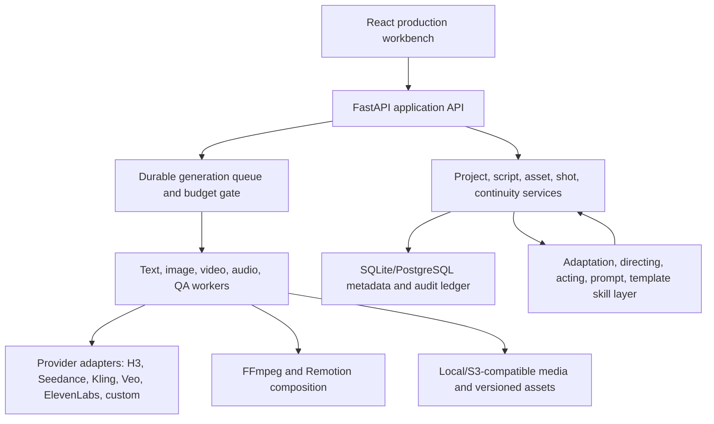

# Implementation Plan: Unified AI Short-Drama Studio

> This document preserves the full parity roadmap and original gap analysis. For the current implemented production core and verification boundary, see `tasks/implementation-status.md`.

## Active delivery increment (2026-08-09)

The user has approved the product-platform increment defined by
`tasks/platform-completion-spec.md`: PostgreSQL becomes authoritative for users,
global capability switches, slash-command resolution, the four-class element
library, membership/wallet/orders, and payment ledgers. A configured development
administrator replaces the disabled legacy demo account and must change its
password. Real provider charges remain disabled without rotated credentials,
merchant configuration, and an explicit budget.

Execution order: database contracts and failing tests; async repositories and
bootstrap; authenticated/admin APIs; capability/element/user/billing UI; live
PostgreSQL smoke and full regression/security verification.

Status: this active increment is implemented and verified. It does not close the
separately documented legacy SQLite project-store migration, real merchant checkout,
GPU 3GS renderer, full Remotion gallery, or human-reviewed real-provider canary.

## Overview

Build a self-hostable short-drama production studio that reaches capability parity with the 13 referenced projects without mechanically merging incompatible codebases. The system will accept novels, scripts, story fragments, product materials, and existing media; produce traceable scripts and reusable character/scene/prop/effect assets; enforce five-view character sheets and exact 3x3 storyboard boards; generate video through text, image, first/last-frame, multi-image, and multimodal-reference modes; create ElevenLabs speech, SFX, and BGM; then assemble, validate, version, export, and resume the production.

The repository already contains a working prototype and the implementation should evolve it rather than replace it. The detected frontend is React 19.2.6, TypeScript 6.0.2, and Vite 8.0.12. The backend pins FastAPI 0.136.3, Pydantic 2.13.4, HTTPX 0.28.1, and Uvicorn 0.49.0, with JSON-file repositories, FastAPI `BackgroundTasks`, local generated media, and FFmpeg composition. Existing behavior includes an eight-stage workbench, authentication, script parsing, skill import, five-view character-sheet prompting, Seedance first/last-frame and multimodal-reference inputs, terminal-frame carry, local TTS, subtitles, and basic BGM/video composition.

The main gaps against the requested contract are structural rather than cosmetic: storyboard output is a list of individually generated images rather than an exact nine-grid board; five-view sheets are not split or identity-validated; H3 and the other requested provider/preset capabilities are not integrated; the frontend labels ElevenLabs but the backend does not call ElevenLabs; BGM is currently a synthesized tone; clip assembly is hard concatenation without continuity-aware transitions; workflow recovery resets orphaned tasks but does not persist provider submissions/idempotency; there is no automated test suite; and tracked configuration/user/media files create security and privacy risk. The recommended path keeps the current React/FastAPI code while progressively introducing typed contracts, durable storage/queueing, provider adapters, and tests.

## Non-negotiable Product Contracts

### 1. Asset package contract

Every production scene and every storyboard board must resolve immutable versioned references for:

- Characters, including costume/state variants and voice identity.
- Scene/location, including time, weather, layout, lighting, and spatial anchors.
- Props, including ownership, hand, position, condition, and continuity state.
- Effects, including source, timing, interaction target, affected region, and end state.

No storyboard or generation request can become `ready` while any required reference is missing or stale.

### 2. Character five-view contract

Every character variant must have one identity-locked turnaround sheet with five labeled views covering a 180-degree turn: front, front three-quarter, profile, rear three-quarter, and back. Each view must preserve facial geometry, age, body proportions, hair, costume, accessories, color palette, and distinguishing marks. The source sheet, five cropped views, seed/reference IDs, and an automated identity-consistency report are stored together.

### 3. Exact nine-grid storyboard contract

Every storyboard image is an exact 3x3 board containing nine numbered panels. A panel is never an unlabeled decorative frame. If narrative coverage does not naturally fill a board, remaining panels are explicit continuity, insert, reaction, transition, or end-boundary panels rather than blank padding.

Each panel has machine-readable fields for shot purpose, story beat, duration, frame size, lens/aperture, angle, camera movement and its reason, composition, blocking, action axis, eyeline, character/scene/prop/effect references, facial/body performance, start/end state, lighting, sound, incoming/outgoing edit, and generation mode. The board can be losslessly split into nine independently addressable keyframes.

The storyboard rule engine encodes the supplied WeChat reference:

- Establish place, then relationship, then emotion; default coverage progresses wide -> medium -> close when information must be introduced.
- Shot purpose selects shot function: information, emotion, suspense, tension, reversal, shock, or clue.
- Stronger emotion moves closer; denser information slows the edit.
- Rhythm profiles include romance, confrontation, reversal, suspense, horror, comedy, clue, and action.
- Default duration guidance: environment wide 0.8-1.5s, two-shot medium 1-2s, character close 1-1.5s, face/object extreme close-up 0.5-1s, reaction 0.8-1.5s, negative-space hold 1-2s, and cut-to-black hold 0.5-1s.

These are defaults with explicit overrides, not silent hard-coded creative choices.

### 4. Video generation contract

The canonical `VideoGenerationRequest` supports:

- Text-to-video/audio-video.
- Single-image or keyframe-to-video.
- First-frame, last-frame, or first-and-last-frame generation.
- Multi-image reference with role and priority per image.
- Multimodal reference using images, videos, and audio.
- Extension, variation, and partial regeneration when a provider supports them.

Provider capability negotiation validates mode, count, duration, aspect ratio, resolution, audio support, and regional availability before any paid task is submitted. The MiniMax H3 adapter will enforce the documented FL2VA and Ref2VA limits, including up to nine images, up to three video clips, up to three audio clips, and at most twelve mixed input files.

### 5. Continuity and assembly contract

Every accepted clip writes a continuity ledger containing characters, pose, gaze, screen position, action axis, prop ownership/state, effect state, scene/light/weather, wardrobe/damage, motion vector, audio phase, and an extracted terminal frame. A dependent clip begins from the previous accepted terminal state or fails readiness validation.

The edit planner chooses motivated cuts, action matches, eyeline matches, graphic matches, J/L cuts, sound bridges, whip transitions, dissolves, or explicit black holds. It normalizes resolution, frame rate, color space, loudness, and audio sample rate, then runs technical and multimodal semantic QA. A final video cannot pass merely because FFmpeg returned exit code zero.

### 6. ElevenLabs audio contract

ElevenLabs is separated by capability:

- Dialogue/voiceover: `POST /v1/text-to-speech/{voice_id}`.
- Sound effects: `POST /v1/sound-generation` (the supplied base URL).
- Music/BGM: `POST /v1/music`, with optional `POST /v1/music/video-to-music` for picture-led scoring.

The API key is server-only as `ELEVENLABS_API_KEY`; it is never returned to the browser, logged, stored in project JSON, or committed. The plaintext key supplied in chat will not be copied into this repository and should be rotated before implementation testing.

## Architecture Decisions

### Clean-room capability parity

Reuse is license-aware. MIT and Apache-2.0 components may be adapted with notices; CC BY 4.0 material retains attribution. ArcReel's AGPL-3.0 code, DramaClaw's Elastic-2.0 code, and sources without a repository license are treated as behavioral references only and reimplemented behind original interfaces. MiniMax H3 model/API use remains subject to its own current license and service terms.

### Canonical domain model before providers

Creative decisions are stored independently from any provider prompt. Provider renderers compile the same typed project state into H3, Seedance, Kling, Veo, or other provider-specific requests. This prevents one provider's syntax from becoming the product data model.

### Durable, idempotent workflow

Every paid or long-running operation uses an immutable submission descriptor, idempotency key, attempt budget, provider task ID, prompt/asset fingerprints, acceptance context, and append-only audit event. Resume polls or downloads the original task instead of silently submitting a duplicate.

### Human approval gates

Story direction, source adaptation, five-view identity, look development, nine-grid storyboard, voice casting, paid generation budget, and final cut are approval gates. Individual rejected assets can be regenerated without invalidating unrelated accepted work; dependent artifacts become stale through recorded lineage.

### Provider-neutral media infrastructure

Text, image, video, TTS, SFX, and music backends expose capability descriptors and typed requests. Storage uses content-addressed media records and S3-compatible objects. FFmpeg handles deterministic normalization/composition; Remotion handles reusable motion-graphics and product-promo templates.

### Incremental migration of the current prototype

Do not perform a big-bang rewrite. First place typed schemas, provider interfaces, and tests around `backend/app/core/model_gateway.py`, `backend/app/core/media_compositor.py`, and `backend/app/service/drama_service.py`. Then extract responsibilities into focused modules. JSON repositories remain supported for local migration only; production durability moves to SQLite/PostgreSQL plus a real worker queue. The current frontend remains the shell and is decomposed from its single large `App.tsx` as vertical features land.

## High-level Architecture

## Vertical Delivery Phases

### Phase 0: Foundation and provenance

- Preserve the current React/FastAPI application while establishing frozen dependency boundaries, CI, source registry, attribution, configuration, and security baseline.
- Implement typed identifiers, artifact lineage, capability negotiation, cost units, and workflow events.
- Migrate credential-looking values out of tracked `backend/config.json`, remove tracked user/media runtime data from the release boundary, and rotate every exposed provider key.
- Checkpoint: existing frontend/backend smoke flow still works; migrations, worker smoke test, and secret scan pass.

### Phase 1: Source-to-script production

- Ingest TXT, Markdown, DOCX, PDF, and FDX with provenance and prompt-injection isolation.
- Build story graph, relationships, timeline, adaptation map, episode beats/hooks, screenplay editor, review/fix loop, and production lifecycle.
- Checkpoint: an uploaded source produces a traceable, editable episode script without generating paid media.

### Phase 2: Versioned asset production

- Build character, costume, voice, scene, prop, effect, style, and spatial-world assets.
- Enforce character five-view generation/splitting/identity QA and scene/prop/effect reference packages.
- Checkpoint: no scene can enter storyboard readiness without a complete, approved asset package.

### Phase 3: Nine-grid directing and prompt compilation

- Implement the supplied article's purpose/order/rhythm/duration rules, causal action/dialogue chains, facial-performance direction, exact nine-panel boards, and board splitting.
- Compile provider-native H3/Seedance/Kling/Veo prompts while preserving the canonical shot model.
- Checkpoint: every board contains exactly nine detailed, validated panels with complete asset references and continuity boundaries.

### Phase 4: Image/video execution and recovery

- Implement provider adapters, asynchronous queues, rate/cost budgets, task recovery, first/last-frame and multimodal-reference requests, acceptance-tail propagation, and semantic QA.
- Checkpoint: a stopped run resumes without duplicate paid submissions and rejected clips never seed dependent shots.

### Phase 5: ElevenLabs and audio direction

- Implement voice casting and TTS, SFX generation, music composition/video-to-music, beat map, dialogue alignment, ducking, loudness, and audio continuity.
- Checkpoint: a scene has synchronized dialogue, effects, BGM, reproducible mix metadata, and no exposed credential.

### Phase 6: Natural edit, templates, and export

- Implement continuity-aware transitions, deterministic FFmpeg assembly, Remotion shot recipes/product templates, LUT/color matching, subtitles, platform variants, editable project package, and Jianying draft export.
- Checkpoint: multi-clip output has no gaps or duplicated frames, passes continuity/technical QA, and exports both master and editable deliverables.

### Phase 7: Production workbench and platform capabilities

- Deliver project/episode/script/asset/storyboard/timeline views, infinite canvas, task center, histories, rollback, budget dashboards, provider settings, assistant actions, archive/import/export, auth/RBAC, plugins, localization, external-agent API, and optional membership/points/payment modules.
- Checkpoint: the complete golden-path project can be operated from the UI and API with audit history and access control.

### Phase 8: Preset parity and release qualification

- Ship the nine MiniMax skill families, drama workflow skills, facial-performance modes, visual directing/prompt audits, action/dialogue modes, novel-to-short-drama flow, and licensed Video Shotcraft recipe/template catalog as selectable presets.
- Run offline provider fakes, contract tests, E2E browser flows, security review, dependency audit, license/NOTICE check, and golden media fixtures.
- Checkpoint: every row in `tasks/upstream-capability-matrix.md` has an automated or manual acceptance test and no row remains “claimed but unverified.”

## Definition of Done

Every increment must satisfy its acceptance criteria, runtime behavior tests, regression suite, formatting/linting, integration checks, documentation, security review, observability, rollback path, and human review. Media features additionally require deterministic fixture tests, provider-call fakes, cost/idempotency tests, and visual/audio manual acceptance where objective automation is insufficient.

## Risks and Mitigations

| Risk | Impact | Mitigation |
|---|---|---|
| “All capabilities” spans multiple full products | High | Track parity per source and deliver vertical slices; never mark a capability complete without an acceptance test. |
| Restrictive or missing licenses | High | Clean-room reimplementation for AGPL/Elastic/unlicensed sources; preserve Apache/MIT/CC attribution. |
| Provider APIs and model limits change | High | Capability discovery, versioned provider adapters, contract fixtures, and official-doc verification before implementation. |
| Generative identity/continuity remains probabilistic | High | Strong reference contracts, accepted-tail propagation, automated semantic QA, limited targeted retries, and human gates. |
| Paid-task duplication | High | Immutable descriptors, idempotency keys, remote task persistence, attempt budgets, and fail-closed resume. |
| Uploaded documents/media are hostile | High | Sandboxed parsing, file-size/type limits, malware/media probing, SSRF prevention, and no direct execution of model output. |
| Secret exposure | High | Rotate supplied key, server-only secret injection, redaction, encrypted secret store, and secret scanning. |
| Existing tracked credential-looking values and user/media data | High | Inventory without printing values, rotate keys, replace tracked files with placeholders/migrations, and keep runtime data outside git. |
| Exact nine-panel boards become creatively rigid | Medium | Keep the 3x3 output invariant while allowing panel roles such as insert, reaction, transition, and boundary coverage. |
| Natural transitions are subjective | Medium | Combine objective media checks, continuity-state checks, multimodal review, and a final human approval gate. |

## Decisions Recorded and Remaining External Inputs

1. The current React/FastAPI stack is retained. PostgreSQL is authoritative for the new platform modules, while the legacy production repositories continue through the documented incremental migration path.
2. Clean-room behavioral parity is used for AGPL, Elastic-2.0, and unlicensed sources; their code is not copied into this distribution.
3. Membership, points, sandbox payments, and signed callbacks are included in the current platform increment. Real WeChat/Alipay checkout stays fail-closed until merchant identities, certificates, and callback credentials are supplied.
4. The provider keys pasted into chat are treated as exposed and were not persisted. They must be rotated and supplied only through the deployment secret store before an explicitly budgeted provider canary.
